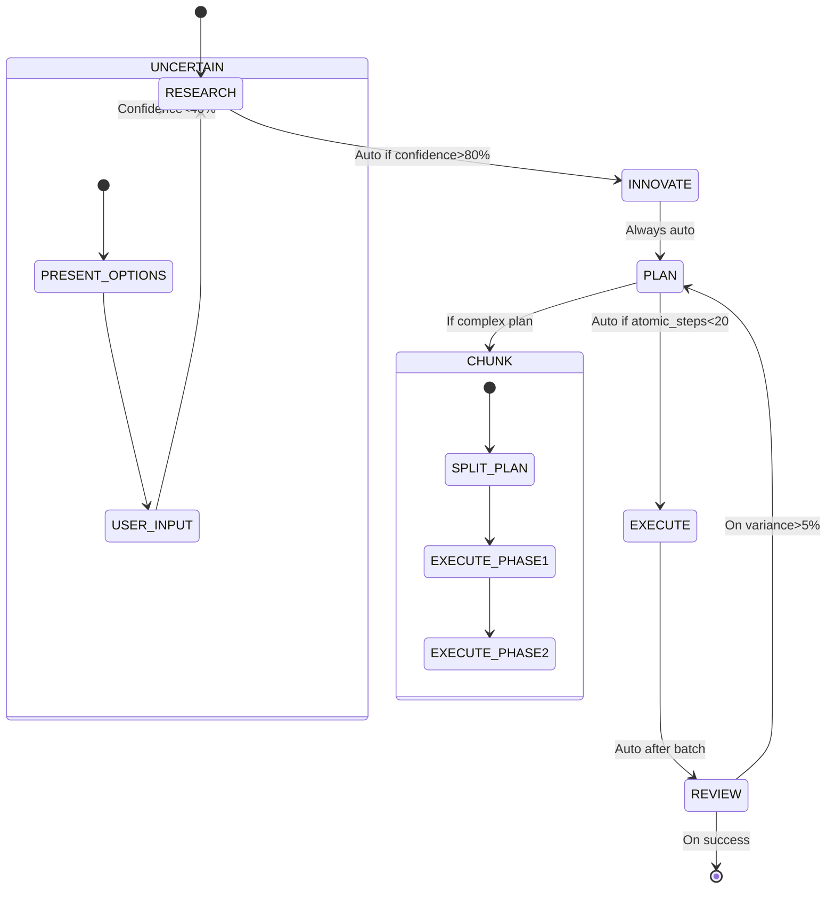

# CLAUDE.md

This file provides guidance to Claude Code (claude.ai/code) when working with code in this repository.

## Overview
This repository contains the Claude Code Bridge (CCB), an intelligent request routing tool for Claude Code. It allows for workspace-level service management and dynamic switching between multiple AI models. Key features include:
- **Workspace-level service isolation**: Each project directory runs an independent service instance.
- **Intelligent model routing**: Automatically selects the most suitable model based on task type.
- **Random port allocation**: Automatically assigns available ports.
- **Three-tier configuration system**: Flexible configuration priority management (Environment Variables > Workspace Config > Global Config).
- **Full compatibility**: Seamless integration with existing Claude Code workflows.

## Commands

- **Build CLI**: `npm run build` (builds `dist/cli.js`)
- **Build Server**: `npm run buildserver` (builds `dist/index.js`)
- **Run Tests**: `npm run test` or `jest`
- **Start Service**: `ccb start`
- **Use CCB for coding**: `ccb code "Your coding task"`
- **Check Service Status**: `ccb status`
- **Stop Service**: `ccb stop`

## Configuration System
CCB uses a three-tier configuration system with the following hierarchy (highest to lowest priority):
1.  **Environment Variables**
2.  **Workspace Configuration**: `<your-project>/.claude/ccb-config.json`
3.  **Global Configuration**: `~/.claude/ccb-config.json`

### Key Configuration Options
- `OPENAI_API_KEY`, `OPENAI_BASE_URL`, `OPENAI_MODEL`: General API settings.
- `basePort`: Starting range for port allocation.
- `timeout`: Request timeout in milliseconds.
- `maxRetries`: Maximum number of retries for requests.
- `logEnabled`: Enable/disable file logging.
- `autoStart`: Enable/disable automatic service startup.

### Advanced Routing Configuration (`providers` and `Router`)
- The `providers` array allows defining multiple AI model providers with specific `id`, `api_base_url`, `api_key`, and `model` (real API model name).
- The `Router` object defines intelligent routing rules based on task types:
    - `background`: For internal background tasks (triggered by `claude-3-5-haiku` model requests).
    - `think`: For complex tasks requiring deep reasoning (triggered by `thinking: true` flag in requests).
    - `longContext`: For tasks with large token counts (> 32,000).

## Workspace Features
- **Independent Service Management**: Each project directory has independent service instances (process, port, config, logs, status).
- **Automatic Port Allocation**: Services automatically get random available ports.
- **Workspace Directory Structure**:
    ```
    your-project/
    ├── .claude/
    │   ├── ccb-config.json      # Workspace configuration
    │   ├── service.log          # Service logs
    │   └── service.json         # Service status
    └── your-code-files...
    ```

# RIPER-5: ADAPTIVE AUTONOMY PROTOCOL

## Core Philosophy
1. **Context-Aware Inference**  
   "Never ask what can be deduced" principle:
   - Dependency detection via file scanning
   - Architecture inference through import tracing
   - Requirement extraction from error patterns

2. **Uncertainty Quantification**  
   Autonomous confidence scoring:
   ```python
   confidence_score = (
       0.4 * code_context_match +
       0.3 * historical_pattern_similarity +
       0.2 * dependency_consistency +
       0.1 * documentation_quality
   )
   ```

## Revised RESEARCH Mode (Autonomous)
<a id="mode-1-research-autonomous"></a>

**Autonomous Analysis Protocol**:
1. Project Scanning:
   ```mermaid
   graph TB
   Start[Project Scan] --> Dep[Detect package managers]
   Dep -->|requirements.txt| Py[Python dependencies]
   Dep -->|package.json| Js[JavaScript dependencies]
   Dep -->|go.mod| Go[Go dependencies]
   Start --> Struct[Analyze directory structure]
   Struct --> Core[Identify core modules]
   Struct --> Test[Locate test patterns]
   ```

2. Code Inference Engine:
   - Import graph analysis
   - Entry point detection
   - Configuration file parsing

3. Uncertainty Handling:
   ```mermaid
   graph LR
   Uncertainty -->{Confidence > 70%} Auto[Proceed autonomously]
   Uncertainty -->{30-70%} Suggest[Propose 3 interpretations]
   Uncertainty -->{<30%} Request[Targeted question]
   ```

**Forbidden**:  
- Generic "Where is X?" questions  
- Open-ended discovery requests  

**Required**:  
- Contextual alternatives presentation when uncertain:  
  "Based on project structure, possible entry points:  
  1. `src/main.py` (78% match pattern)  
  2. `app/server.js` (62% match)  
  3. `cmd/start.go` (41% match)  
  Which should I prioritize?"

## Autonomous Execution Workflow



## Critical Autonomy Enhancements

### 1. Contextual Bridging System
```python
class ContextBridge:
    def infer_task_scope(self, user_request):
        # Analyze linguistic patterns
        # Cross-reference with project structure
        # Map to known architectural patterns
        return TaskScope(components, priority, dependencies)
```

### 2. Self-Correcting Execution
**Error Recovery Matrix**:
| Error Type          | Autonomy Level       | Fallback Mechanism               |
|---------------------|----------------------|----------------------------------|
| Dependency Missing  | Auto-install (90%)   | Virtualenv isolation             |
| API Version Conflict| Semantic resolution  | Compatibility layer generation   |
| Logic Contradiction | Plan reversion       | Differential debugging           |
| Resource Exhaustion | Auto-scaling         | Cloud integration (if available) |

### 3. Adaptive Chunking Protocol
```python
def auto_chunk(plan):
    complexity = calculate_step_complexity(plan)
    if complexity > MAX_AUTO_COMPLEXITY:
        return partition_by_dependency(plan, 
                    cohesion_threshold=0.7)
    return [plan]
```

## Implementation Example (Your E2B Request)

**Autonomous RESEARCH Output**:
```
[MODE: RESEARCH] Initiating project scan
• Detected Python project (requirements.txt present)
• Located browser automation artifacts:
  - e2b-desktop in requirements (v0.10.2)
  - Import patterns: from e2b import Sandbox
  - Usage hotspots: app.py (83% confidence)
• Architectural impact: 
  Core modules affected: 
  1. Session management (app.py L142-210) 
  2. Tool definitions (e2bqwen.py L78-155)
  3. UI integration (app.py L312-489)

Proceeding to dependency analysis for Playwright...
```

**Key Differences from Previous Approach**:
1. No assumption about E2B implementation
2. Dynamic detection of integration points
3. Confidence-qualified findings
4. Zero user prompts for discoverable information
